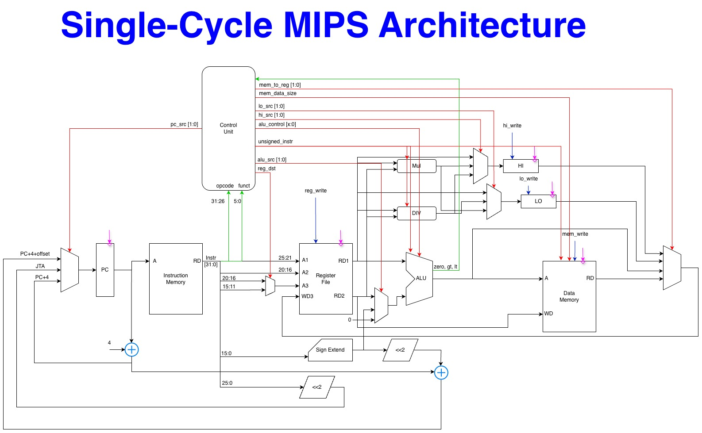
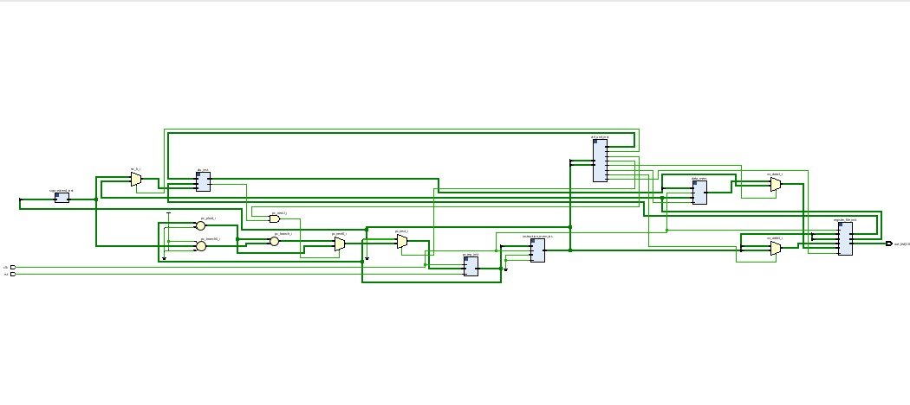

# Single-Cycle MIPS-32 Processor

## Overview
This repository contains the Verilog HDL implementation of a 32-bit single-cycle MIPS processor. The design supports a core subset of the MIPS instruction set, including R-type, I-type, and J-type [...]

As a single-cycle architecture, the entire datapath (instruction fetch, decode, execute, memory access, and write-back) completes in a single clock cycle. This architecture inherently trades high m[...]

## Features & Architecture
* **Instruction Support:** Full execution of standard R-type, I-type, and J-type instructions (Arithmetic, Logic, Memory Load/Store, Branching, and Jumping).
* **Control Unit:** Structured two-level decoding (Main Decoder + ALU Decoder) managing all control signals across 6 core instruction types.
* **Register File:** Fully parameterized 32x32-bit register file.
* **Memory:** Synchronous Instruction and Data memory implementation.

## Implementation Details (Vivado / Artix-7)
The core was synthesized and implemented using Xilinx Vivado targeting the Artix-7 architecture. The design cleanly routes with positive slack.

* **Target Board:** Basys3 (Xilinx Artix-7)
* **Maximum Frequency ($F_{max}$):** ~52.7 MHz
* **Worst Negative Slack (WNS):** +1.022 ns (Targeting a 20 ns clock period)
* **Look-Up Tables (LUTs):** 1,054
* **Flip-Flops (FFs):** 1,036
* **Routing Violations:** 0

## Verification
Functional correctness was verified using a directed testbench. The test suite covers all datapath operations, verifying:
* Accurate load/store data alignment.
* Correct branch calculation and resolution.
* Expected ALU outputs for all supported operations.

